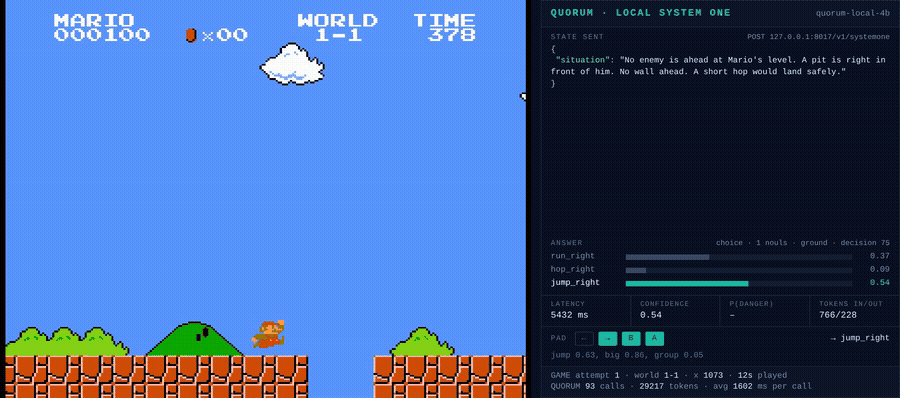

# quorum

A local, private re-implementation of the [TypeSafe AI](https://typesafe.ai)
SystemOne request contract -- one state, N typed judgment questions,
probabilities back -- running on your own hardware, plus a calibration harness
that turns logged judgments into a training-adjacent corpus.

Point it at any llama-server-compatible endpoint. It answers `noul`, `choice`
and `score` questions by constraining the model's output and reading token
logprobs, so a "probability" falls out of the decode instead of being parsed
out of prose. No account, no billing, nothing leaves the machine.

**The model behind it is ours, and it is open.** quorum runs on
[judgment-qc-gate-qwen3-4b](https://huggingface.co/AltronisSG/judgment-qc-gate-qwen3-4b-GGUF),
our Qwen3-4B fine-tune for judging work, on Hugging Face under Apache-2.0: a
4.3 GB Q8_0 GGUF, with the LoRA adapter, training corpus notes and limitations in the
[companion repo](https://huggingface.co/AltronisSG/judgment-qc-gate-qwen3-4b-lora).
It is the file our own agent gate runs in production (its sha256 matches the
Hugging Face copy). Any llama-server model works behind the shim; this is the one
we run and test against.

## Why Jev, and why this exists

[Jev](https://typesafe.ai) is TypeSafe's System One model: small, fast
language-model judgments with *trained* calibration, trained with RLCD against
human judgment references. It's the idea that made this project worth doing --
judgments as typed primitives (`noul` / `choice` / `score`) that code can
combine, rather than prompt-and-parse string guessing.

We ran Jev in production for months, and hit three walls that are fine for a
demo but not for an always-on gate:

- **cost per call.** Our judgment hooks fire on every prompt, every file diff,
  every completion -- thousands of small calls a week. Per-call pricing turns a
  guardrail into a meter.
- **privacy.** The states we judge are unreleased code diffs, client names,
  draft emails. They shouldn't transit an API to be graded.
- **no knob on the model itself.** When we measured the local-vs-cloud gap on a
  trace-classification benchmark, what we needed was to *retrain on our own
  labeled judgments* -- something a hosted model can't offer.

So: keep the wire contract, swap the brain. `quorum` speaks the same
`POST /v1/systemone` shape, runs against our own local 4B judgment model, and adds the piece
the hosted API doesn't give you -- a calibration loop over your own corpus.

The name: a *quorum* is multiple independent judgments called over one state.
That's literally what each request does.

## What it is / isn't

- **Is:** a drop-in ASGI shim (`serve.py`) over any llama-server-compatible
  upstream, with structured-output decoding, an opt-in chain-of-thought mode,
  per-question temperature calibration, and a client (`gate_client.ask`) that
  logs every call.
- **Is not:** a trained System One model. The probabilities are constrained-LLM
  logprobs -- good for *ranking* ("diff A riskier than that one"), not certified
  calibrated numbers. `confidence` is the winning option's probability, a
  concentration proxy. This is the honest gap vs Jev and we say so up front.
  `quorum.calibrate` narrows the gap; it does not erase it.

## Demo: a local 4B clears Super Mario Bros 1-1



Every decision in that run is a `noul` question answered by the 4B behind this shim
([full video](docs/media/mario-1-1-quorum-local-4b.mp4), paused-emulator harness). It also clears
the level live, emulator never paused, from memoised judgments
([live video](docs/media/mario-1-1-quorum-local-4b-live.mp4), 38 s, median lag 1 frame).

Asked cloud Jev's single 5-way question, the same 4B answered `run_right` 22 times in a row
and died at the first goomba. It cleared the level once the judgment was cut into plain yes/no
questions, one per call, over a state written in words, with thresholds fitted against cloud
Jev's logged decisions as the teacher. Every action in the video is the model's answers, with
no code overrides. What a 4B can and cannot read is in [examples/mario](examples/mario/); the
method and how to reuse it on other tasks is in
[docs/judgment-decomposition.md](docs/judgment-decomposition.md).

## Benchmark: quorum vs Jev vs laya

We ran quorum, cloud Jev and [laya](https://huggingface.co/convaiinnovations/laya) (open
ModernBERT decision heads) over the same 3,664 items: 18 tasks, 5,327 scored questions,
with a paired bootstrap on every difference. Full tables, rules and fairness notes are in
[docs/benchmark.md](docs/benchmark.md); the harness is [bench/arena](bench/arena/).

**Scorecard.** Pooled over the 17 tasks all four systems ran (Jev never sees gate, our
private agent-review set). ECE measures how far stated confidence is from the hit rate;
lower is better. AUROC measures how well P(yes) ranks yes items above no items (1.0 is
perfect, 0.5 is chance). "Fitted" means a map learned from labeled answers under 5-fold
cross-validation (`quorum.calibrate` does this from your own log).

| | Jev (hosted) | laya | quorum + our judge | quorum + Qwen3-4B-2507 |
|---|---|---|---|---|
| accuracy, raw (17 shared tasks, 5,201 units) | 0.801 | 0.491 | 0.580 | 0.684 |
| accuracy, fitted yes/no threshold | 0.805 | 0.522 | 0.588 | 0.690 |
| highest raw accuracy, tasks of 18 | 16 | 2 | 0 | 1 |
| ECE, raw (median of 8 tasks, see note) | 0.092 | 0.201 | 0.139 | 0.181 |
| ECE, fitted map (median of 8 tasks, see note) | 0.031 | 0.051 | 0.054 | 0.059 |
| AUROC on yes/no (median, 8 tasks) | 0.970 | 0.736 | 0.791 | 0.911 |
| ms per item, one question (median) | 311 | 152 | 482 | 304 |
| ms per item, five questions | 316 | 1226 | 1430 | 1254 |
| runs on | hosted API | CPU, fp32 | 4B at Q8_0, local GPU | 4B at Q8_0, local GPU |
| the state leaves your machine | yes | no | no | no |

Note on the ECE rows: they use the 8 tasks where every answer from every system carries a
probability. On the other 10, Qwen3-4B-2507 is sometimes so sure of its answer that no
second option reaches its 12 most likely tokens, and quorum returns no probability (881
answers). Under the rules those score as uniform, which would inflate its ECE, so this row
leaves those tasks out.

**Accuracy by task, raw** (no calibration; bold is the highest in each row). laya's typed-decisions specialist, trained on those four workflows, scores 0.766 there.

| task | majority floor | Jev (hosted) | laya | quorum + our judge | quorum + Qwen3-4B-2507 |
|---|---|---|---|---|---|
| agnews | 0.290 | 0.843 | **0.923** | 0.853 | 0.837 |
| banking77 | 0.027 | **0.807** | 0.357 | 0.573 | 0.660 |
| cuad | 0.500 | **0.925** | 0.658 | 0.825 | 0.887 |
| emotion | 0.367 | **0.620** | **0.620** | 0.577 | 0.590 |
| gate | 0.500 | n/a | 0.492 | 0.413 | **0.587** |
| injection | 0.517 | **0.767** | 0.621 | 0.517 | 0.534 |
| irony | 0.500 | **0.853** | 0.687 | 0.567 | 0.733 |
| legalbench | 0.500 | **0.866** | 0.634 | 0.629 | 0.766 |
| mario | 0.782 | **0.994** | 0.345 | 0.758 | 0.952 |
| massive_en | 0.140 | **0.933** | 0.700 | 0.640 | 0.793 |
| massive_ms | 0.140 | **0.900** | 0.213 | 0.520 | 0.673 |
| massive_ta | 0.140 | **0.920** | 0.273 | 0.340 | 0.627 |
| massive_zh | 0.140 | **0.907** | 0.600 | 0.607 | 0.793 |
| offensive | 0.500 | **0.813** | 0.627 | 0.607 | 0.753 |
| spam | 0.500 | **0.973** | 0.773 | 0.820 | 0.853 |
| sst2 | 0.500 | **0.960** | 0.620 | 0.793 | 0.907 |
| sst5 | 0.275 | **0.565** | 0.295 | 0.325 | 0.460 |
| typed_decisions | 0.461 | **0.740** | 0.361 | 0.497 | 0.598 |
| **pooled, 17 shared tasks** | | 0.801 | 0.491 | 0.580 | 0.684 |

**gate, by question.** 63 held-out items from our judge's training data, 43 of which broke a
standard. Higher is better in every column; Jev never sees gate.

| system | question | right verdict (16 options), of 63 | good items passed, of 20 | broken items caught, of 43 |
|---|---|---|---|---|
| laya | verdict | 26 | 18 | 24 |
| laya | yes/no | - | 13 | 23 |
| quorum + our judge | verdict | 27 | **20** | 20 |
| quorum + our judge | yes/no | - | **20** | 5 |
| quorum + Qwen3-4B-2507 | verdict | 20 | 1 | **43** |
| quorum + Qwen3-4B-2507 | yes/no | - | 11 | **43** |
| our judge in its own format, no quorum | verdict | **35** | **20** | **43** |

- **quorum on our judge beats laya** by 0.085 accuracy pooled over all 18 tasks (95% CI
  0.068 to 0.102). It is ahead on 6 tasks, behind on 2, and level on the other 10.
- **quorum trails Jev** by 0.221 (0.206 to 0.236), and only draws with it on AG News.
  That is the honest gap between a 4B used zero-shot and a hosted model trained for this
  contract.
- **What closes part of it:** chain-of-thought (+0.088 on a 50-item slice, at about 4x
  the latency), one call per question on multi-question states (+0.065), and a
  cross-validated yes/no threshold (SST-2 0.793 to 0.920).
- **The model file matters most.** The same shim in front of stock Qwen3-4B-Instruct-2507
  is 0.106 ahead of our judge (0.092 to 0.119), 0.190 ahead of laya over all 18 tasks, and
  0.117 behind Jev. Its raw probabilities sit near 0 or 1, so fit a map (`quorum.calibrate`)
  before trusting them. Our judge keeps its edge on the job it was trained for: asked in its
  own format, it passes all 20 good gate items and catches all 43 broken ones.
- **Raw probabilities are overconfident.** A cross-validated map of one or two numbers
  per question type brings quorum's ECE under 0.10 on 15 of 18 tasks (5 of 18 raw).

## Quick start

```bash
# the judgment model on :8005 (or any llama-server model)
hf download AltronisSG/judgment-qc-gate-qwen3-4b-GGUF judgment-qwen3-4b-Q8_0.gguf --local-dir .
llama-server -m judgment-qwen3-4b-Q8_0.gguf --host 127.0.0.1 --port 8005 \
  --ctx-size 4096 --parallel 1 -ngl 99 -fa 1 --jinja --reasoning-budget 0 --cache-ram 0

# serve quorum on :8017 against it
uvicorn quorum.serve:app --host 127.0.0.1 --port 8017
# env: QUORUM_UPSTREAM, QUORUM_MODEL_ALIAS, QUORUM_PORT, QUORUM_COT,
#      QUORUM_LOG, QUORUM_CALIBRATION, QUORUM_MAX_STATE_CHARS,
#      QUORUM_FANOUT, QUORUM_FANOUT_CONCURRENCY, QUORUM_STATE_FORMAT,
#      QUORUM_CACHE_SIZE
```

One request, three primitives:

```bash
curl -s 127.0.0.1:8017/v1/systemone -H 'content-type: application/json' -d '{
  "state": "any text or JSON object",
  "questions": {
    "urgent": {"type": "noul", "instructions": "Does this express urgency?"},
    "team":   {"type": "choice", "instructions": "Which team",
               "criteria": {"billing": "payments", "technical": "bugs"}},
    "mood":   {"type": "score", "instructions": "Frustration level",
               "criteria": ["calm: factual", "annoyed: irritated", "angry: hostile"]}
  }
}'
```

From Python (stdlib only):

```python
from quorum.gate_client import ask
r = ask({"review_type": "outbound email", "situation": "...draft text..."},
        {"regrettable": {"type": "noul", "instructions": "Would we regret sending this?"}},
        caller="my-hook")
print(r["probs"]["regrettable"])   # float 0..1
```

## The calibration-corpus story

This is the part the hosted API can't do, and the reason the project exists
locally.

Every call through `gate_client` is appended to a JSONL log (`QUORUM_LOG`):
state, questions, probabilities, latency, caller. Run long enough and the log
becomes what an API bill never is -- **a labeled record of the judgments your
system actually made**, with outcomes you can fill in later.

Four things grow out of that corpus:

1. **Measure the gap.** `python3 -m quorum.report` audits the log itself --
   per-question Brier, log-loss, 10-bin ECE, a reliability table and a
   confident-error list (high-prob calls that were wrong), with the
   majority-class floor printed next to decision accuracy so a 95%-one-class
   question doesn't look like a win. Borrowed from the kev/Jev eval harnesses:
   score calibration as well as accuracy. Needs labels -- that's the next step.
2. **Label what mattered.** `python3 -m quorum.label` walks the log
   newest-first, one judgment per screen; Enter agrees with quorum, `n`
   overrides per question. Verdicts merge into the log as a `labels` dict --
   the bridge between "logged" and "calibratable".
3. **Runtime calibration.** `python3 -m quorum.calibrate labeled.jsonl` fits a
   per-question-type temperature (NLL minimisation over the logged probs) and
   writes `calibration.json`, which `serve.py` picks up automatically. Raw
   logprob → tuned logprob, no retraining. `--noul-method platt` fits yes/no
   questions with Platt scaling instead (a slope and an offset, so it can also
   fix a bias toward "yes"); it is refused below 30 labels or when it does not
   beat the identity map. The log keeps the raw answers next to the served
   (calibrated) ones and calibration always refits on the raw ones, so a
   second fit never compounds the first. (`bench/fit_calibration.py` goes
   further -- Platt maps fitted against the cloud-Jev teacher with 5-fold CV;
   `bench/calibration_teacher.json` is the honest result: vs cloud probs,
   ECE 0.23 → 0.13 fitted, but vs gold labels the local 4B still doesn't
   separate classes on every task. That gap is what the corpus loop is for.)
4. **A fine-tuning set.** Our own judgment gate -- a Qwen3-4B LoRA trained on
   647 reviewed situation→verdict pairs mined from months of agent logs --
   follows the same loop: log judgments, label the ones that mattered, train,
   probe, ship. The corpus *is* the product; the weights are just its current
   compiled form ([AltronisSG on Hugging Face](https://huggingface.co/AltronisSG),
   Apache-2.0).

The loop, end to end:

```
agent work → hooks ask quorum → judgments logged → humans label what mattered
   → calibrate (T per question type)  →  better probabilities today
   → fine-tune (LoRA on the labeled set) → better base model tomorrow
```

## Tests

```bash
python -m pytest tests/ -q              # the shim
python -m pytest examples/mario -q      # the Mario example: state decoding and policy
cd bench/arena && python -m pytest -q   # the benchmark: metrics, report, adapters, runner
```

## Credits & license

- The System One framing, the `noul`/`choice`/`score` primitives, and the
  goal of calibrated language-model judgment are TypeSafe AI's -- see
  [typesafe.ai](https://typesafe.ai) and their Jev / RLCD work. "SystemOne"
  and "Jev" are their concepts; this project is an independent local
  re-implementation of the request contract, not their software.
- Model served here: our judgment model,
  [AltronisSG/judgment-qc-gate-qwen3-4b-GGUF](https://huggingface.co/AltronisSG/judgment-qc-gate-qwen3-4b-GGUF)
  (Apache-2.0), a LoRA fine-tune of Qwen3-4B (Apache-2.0), via llama.cpp/llama-server.
- quorum code: Apache-2.0 -- see [LICENSE](LICENSE).
