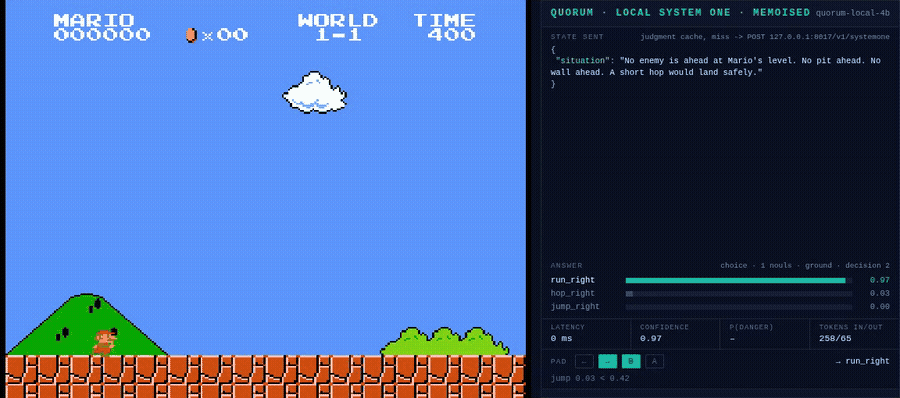

# A local 4B clears Super Mario Bros 1-1 through quorum


Full run, start to flagpole: [mario-1-1-quorum-local-4b.mp4](../../docs/media/mario-1-1-quorum-local-4b.mp4)

Every model decision in that video is a `noul` question posted to the quorum shim on
`127.0.0.1:8017`, answered by a Qwen3-4B fine-tune on the same box. Nothing leaves the
machine. 226 decisions, 288 model calls, about 1.7 s per call, 0 failed calls. Every action,
on the ground and in the air, is picked by the model's answers. Code only maps answers to
buttons: no vetoes, no fallback action, the same rule the cloud harness follows when it presses
whatever Jev chose. Decoding is greedy and the emulator is stepped exactly, so the same code
replays the same run.

That run is not real time. The emulator is paused while the model answers and stepped an exact
number of frames between decisions, then the video is assembled at true game speed. A 4B at
1.7 s per judgment cannot steer a 60 fps game call by call. It can play live from memoised
judgments, which is the second video, further down.

## What failed first

Cloud Jev clears this level with one 5-way `choice` question (run, hop, jump, wait, run left)
over a JSON state. We sent the local 4B the same question and the same state.

It answered `run_right` on all 22 decisions and died at the first goomba. With the goomba
1.5 tiles ahead its own rationale read: "The path ahead is clear: 8 floor tiles, no hazards."
It read the terrain and never looked at the enemies. Reordering the options, putting the
threat first, handing it a precomputed flag: same answer every time.

## What made it work

We used cloud Jev's logged runs as a teacher. Its decisions on this level (159 ground
decisions, 36 of them jumps) are labels we already had, so every design below was scored
offline in minutes with `bench4b.py`, without starting the emulator.

What the bench showed about this 4B:

| design | result |
|---|---|
| no rationale (direct mode) | noise. It reports an enemy at p=0.36 with no enemy in the state |
| four yes/no questions in one call, JSON state | the enemy answer means "an enemy exists": p=0.75 at 3 tiles, p=0.77 at 7.5 tiles |
| one question per call, distances as numbers | ranks correctly but still answers "no" at 3.0 tiles. It cannot compare decimals |
| an ASCII map of the screen | worse than prose. Close goomba and empty ground both read 0.50 |
| "would a short hop be too small here?" | inverted, AUC 0.03. Negative phrasing flips it |
| a fourth "or" added to a question that worked | broke it: a reading that was 0.58 fell to 0.08 |
| a 3-way `choice` (run, hop, jump) over the words state | answers hop on 27 of 28 situations, 15 of 28 correct |
| a 3-level `score` (no jump, hop, full jump) over the words state | 20 of 28: reads tall walls, misses pits and enemy groups |
| one yes/no question per call, the situation in words | reads every distinct teacher situation correctly, 28 of 28 |
| the same, with the rationale switched off | 373 ms per judgment, but yes and no overlap again (AUC 0.71) |

So the state became one short paragraph with proximity in words, written by code:

> A goomba is close ahead at Mario's level, toward mario. No pit ahead. A tall (3 tiles)
> wall is still some way off. A short hop would land safely.

and the single overloaded choice became plain presence questions, one per call:

1. "Does Mario need to jump right now?"
2. Only when jumping: "Is a pit or a tall wall close ahead or right in front of Mario, or
   are enemies waiting below a ledge he is about to leave?"
3. Only when jumping: "Do more enemies follow right behind the nearest enemy?"
   A yes to 2 or 3 means a full jump, otherwise a hop.
4. In the air: "Would pulling left save Mario from a pit?"

On the teacher's situations question 1 scores 0.32 or less when the answer is no and 0.53 or
more when it is yes, so the threshold sits at 0.42. Question 2 separates at 0.26 against 0.58,
question 3 at 0.38 against 0.63. The air paragraph only has four forms, all checked: the one
that needs a pull scores 0.77, the rest 0.63 or less, threshold 0.70.

Then four live deaths, each one a gap in the paragraph or the questions, each checked against
the teacher logs before the fix went in: an enemy waiting below a pipe Mario was about to walk
off, a threshold cut too fine, a sentence that had never been in the verified set and read as
"jump now" with the enemy still far away, and a hop into a goomba pair because no question
asked about groups.

## Live play



[Full live run](../../docs/media/mario-1-1-quorum-local-4b-live.mp4): the emulator is never paused,
this is a wall-clock recording. 38 s, 275 decisions, median lag 1 frame between reading the
state and pressing the buttons.

The policy only depends on the paragraph, and there are few paragraphs. Decoding is greedy, so
the model's answer to a given paragraph and question never changes. `warm_cache.py` asks the 4B
every question about every distinct paragraph seen in any logged run (51 paragraphs, 162
questions, about 5 minutes) and stores the answers. At play time a judgment is a lookup. The
answers are still the model's own, computed ahead of time, and a paragraph that is not in the
cache goes to the model while the game keeps running.

That last part is the honest limit. A miss costs about 1.7 s of blind play. Our first two live
attempts each hit a few unseen paragraphs and died; the attempts after that (no misses, and one
miss) both cleared. The HUD says MEMOISED and shows 0 ms when an answer came from the cache.

For comparison we ran cloud Jev live in the same loop, calling the API for every decision:
median lag 19 frames (about 0.3 s), and it died at x=711 and x=314 in two attempts. By the time
the answer lands, Mario is up to three tiles further on than the state it was based on.

```bash
python3 warm_cache.py
python3 play.py --backend local --policy atomic --realtime --judgment-cache --attempts 5
python3 play.py --backend cloud --realtime          # cloud Jev, live, a fresh call per decision
```

## Who does what

- **Code** decodes NES RAM, predicts where each jump lands, writes the paragraph (numbers
  become words here), and maps answers to buttons.
- **The 4B** makes every judgment, through quorum's normal path: constrained yes/no decode,
  P(yes) from the logprob of that one token, per-type temperature calibration. Nothing the
  model writes is parsed.
- **There are no overrides.** An earlier version had code vetoes (never jump into a predicted
  pit, stuck means jump) and a code rule in the air. They are gone. The run in the video is
  the model's answers and nothing else.

Two honest caveats. Mario is geometry, so most of the intelligence is in the code that writes
the paragraph; this is evidence that the System One contract and a calibration loop can be
made to work on a 4B, and a record of what a 4B can and cannot read. It is not evidence that a
4B understands Mario. And the contract is Jev's but the engine is not: our 4B needs a bounded
one-sentence rationale before its answer token or its answers turn to noise, where a trained
System One model answers directly. Closing that gap takes training, not prompting.

## What carries over to other tasks

- one narrow yes/no question per call, never several
- short prose over nested JSON, categories over decimals
- ask about presence, phrase it positively
- keep the rationale on, and bound it
- fit thresholds on a teacher's labels or your own, per question and per model
- when it fails live, find the missing fact, confirm it against the labels, then add it

Two quorum bugs surfaced on the way and are fixed in this repo: options sharing a first token
(`run_right`, `run_left`) read probability 0.0 for the chosen answer, and a runaway rationale
truncated the JSON and returned a 502 that no retry could fix.

## Run it

```bash
pip install playwright && playwright install chromium        # plus ffmpeg for the video
uvicorn quorum.serve:app --host 127.0.0.1 --port 8017        # from the repo root
cd examples/mario
python3 play.py --backend local --policy atomic              # headless, video in runs/<timestamp>/
python3 play.py --backend local --policy atomic --headed     # watch it
python3 -m pytest -q                                          # state decoding and policy, no model needed
```

The teacher logs are not in the repo, they are outputs of TypeSafe's hosted model. Record
your own with a TypeSafe key, then bench a design against them:

```bash
python3 play.py --backend cloud --attempts 3
python3 bench4b.py words-jump words-big --cot --dev
```

`--policy choice` is the original single 5-way question. It is what cloud Jev answers, and
what a larger local model can answer too: pointed at a bigger local model the same harness
hopped and jumped its way to x=804 on the first try.

The game runs in the public browser emulator at smbgames.be. Super Mario Bros is Nintendo's.
